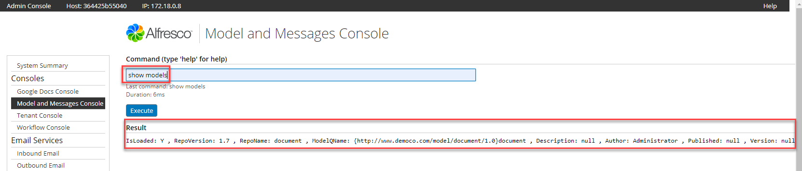
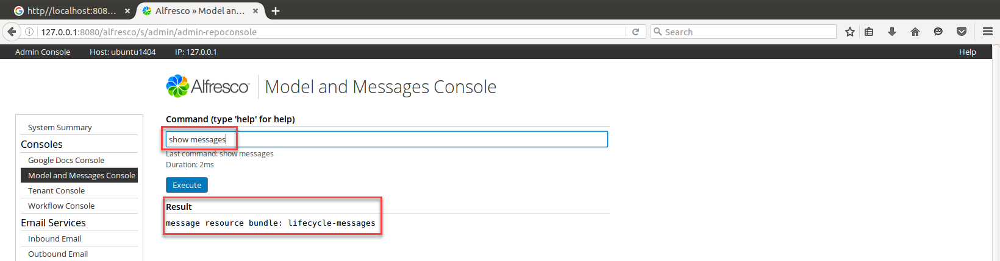

## What is this for?

Alfresco Content Services are highly customizable through [Platform Extensions](https://docs.alfresco.com/6.2/concepts/dev-platform-extensions.html) and [Share Extensions](https://docs.alfresco.com/6.2/concepts/dev-extensions-share.html) to allow, for example, the default [Alfresco Content Model](https://docs.alfresco.com/6.2/concepts/content-model-preconfigured.html) to be extended by creating a [Custom Content Model](https://docs.alfresco.com/6.2/references/dev-extension-points-content-model-define-and-deploy.html).

Additionally the messages displayed to Alfresco end users, for example, through the Share User Interface, can also be customized by deploying a custom Message Resource Bundle in the Alfresco instance.

The Repository Model and Message Console described here provides the Alfresco Administrator management and control of these customizations.

## When is it used?
Whenever either a Custom Content Model or Custom Message Resource bundle is deployed in Alfresco to extend its out of the box functionality and the Alfresco Administrator needs to check the status of these extensions.

???+ info "Note"
The Repository Admin Model and Message Console cannot be used for creating or editing these extensions.

### Custom Content Model Administration
In the snipped screenshot shown below, an example Custom Content Model `Document` has been created following the [Creating Custom Content Model Tutorial](https://docs.alfresco.com/6.2/concepts/admintools-cmm-tutorial.html) as described in the [Share Admin Tools - Model Manager](/acs-administration-share-admin-console) Course. From the Repository Admin Model Console, the Alfresco Administrator can check the name and status all custom Content Models, and can enable/disable the custom model.



### Commands
```
##
##  Model Admin Commands
##

ok> show models
    Show deployed models - that are stored in the repository data dictionary.

ok> deploy model <fileClassPath>
    Upload model to repository and load into runtime data dictionary. This will also set the repository model as active. If a model is already deployed then it will be updated and re-deployed.
    e.g. deploy model alfresco/extension/exampleModel.xml

ok> undeploy model <modelFileName>
    Permanently delete model from repository (all versions) and unload from runtime data dictionary.
    e.g. undeploy model exampleModel.xml

ok> activate model <modelFileName>
    Set repository model to active and load into runtime data dictionary.
    e.g. activate model exampleModel.xml

ok> deactivate model <modelFileName>
    Set repository model to inactive and unload from runtime data dictionary.
    e.g. deactivate model exampleModel.xml
```

#### Repository Model Console versus Share Admin Tools Model Manager
The [Share Admin Tools Model Manager](https://docs.alfresco.com/6.2/concepts/admintools-cmm-intro.html) extends and in many ways supersedes the Alfresco Repository Model Console. For example, you cannot create a new Custom Content Model or export/import a model using the Repository Model Console - but these functions are provided in the Share Admin Tools Model Manager.

The Repository Model Console comes into play when Alfresco is deployed with a Custom Content Model but without ACS Share - for example, in the case where access to Alfresco content is solely through REST or CMIS APIs. In this deployment the Share Admin Tools are unavailable, and therefore the Repository Model Console must be used.

### Message Resource Bundle Administration
In the snipped screenshot below a custom Message Resource Bundle has been included in the `alfresco/extension` path of the Alfresco repository. In this path the resource bundle includes a `lifecycle-messages.properties` file to generate custom messages for a custom "Lifecyle" workflow and business process.



???+ info "Note"
Only bootstrapped Message Resource Bundles are displayed on this console. Bootstrapped Message Resource Bundle files are located in the extension path `<installLocation>/tomcat/shared/classes/alfresco/extension` snad loaded when Alfresco is restarted. Message Resource Bundles deployed dynamically through Share and saved directly to the Repository in the `Data Dictionary` folder are not shown here.

### Commands
```
##
##  Message Admin Commands
##

ok> show messages
    Show deployed message resource bundles that are stored in the repository data dictionary.

ok> deploy messages <resourceBundleClassPath>
    Upload message resource bundle to repository and runtime message service.
    e.g. deploy messages alfresco/extension/lifecycle-messages

ok> undeploy messages <resourceBundleBaseName>
    Remove message resource bundle from repository and from runtime message service.
    e.g. undeploy messages lifecycle-messages

ok> reload messages <resourceBundleBaseName>
    Reload message resource bundle from repository into runtime message service.
    e.g. reload messages lifecycle-messages
    ```
