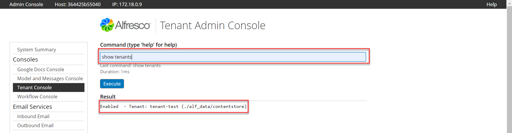

## What is this for?
The Tenant Manager allows the Alfresco Administrator to create, enable, disable and delete Alfresco Tenants (Multi Tentants) within a single Alfresco instance.

Alfresco Content Services is designed to be used predominantly in a single instance, single-tenant (ST) environment where each tenant (for example, customer, company, or organization) runs a single instance that is installed on one server or across a cluster of servers.

When Multi Tenant (MT) is enabled, the Alfresco Content Services instance is logically partitioned such that it will appear to each tenant that they are accessing a completely separate instance of the Alfresco repository. This can be useful for SaaS providers who make Alfresco Content Services available to their customers under an OEM agreement

## When is it used?
The Tenant Console is used when Alfresco is deployed with multiple tenants from the same Alfresco instance. When using a Tenant there are well documented [limitations in Alfresco functionality](https://docs.alfresco.com/6.2/concepts/mt-not-implemented.html). Therefore Alfresco does not advise using this feature in most cases.

Multi Tenant and the Tenant Manager are provided for **limited specific use cases and only for OEM customers**.  

### Example use
In the following Tenant Console screenshot you can see the
command `show tenants` reports `Enabled - Tenant: tenant-test (./alf-data/contentstore)`.

This result occurs after creating the Tenant by executing the command `create tenant-test admin`



In this example, the Tenant-Test tenant will use the default Alfresco contentstore file system but will be partitioned from the default Alfresco repository at the database schema level. It is possible, using a different command (see below) to partition the tenant at the filesystem level too.

As you can see from the screenshot this tenant is enabled and ready for use. To validate the tenant, browse to Alfresco Share and login as
`admin@tenant-test`.

### Commands
Here is a list of the Tenant Console commands:

```
##  Tenant Commands - for administering tenants
##
ok> show tenants
    List all tenants and show their details.

ok> show tenant <tenant domain>
    Show tenant details - status (ie. whether enabled or disabled) and root contentstore
	directory.

    Example:   show tenant yyy.zzz.com

ok> create <tenant domain> <tenant admin password> [<root contentstore dir>]

    Create empty tenant. By default the tenant will be enabled. It will have an admin
    user called "admin@<tenant domain>" with supplied admin password. All users
    that the admin creates, will login using "<username>@<tenant domain>".
    The root of the contentstore directory can be optionally specified,
	otherwise it will default to the repository default root contentstore
	(as specified by the dir.contentstore property).
	The default workflows will also be bootstrapped.

    Examples:  create zzz.com l3tm31n /usr/tenantstores/zzz
               create yyy.zzz.com g00dby3 /usr/tenantstores/yyy.zzz
               create myorg h3ll0

ok> changeAdminPassword <tenant domain> <tenant admin password>

    Useful if the tenant's admin (admin@<tenant domain>) has forgotten their password.

    Example:   changeAdminPassword yyy.zzz.com n3wpassw0rd

ok> enable <tenant domain>

    Enable tenant so that is active and available for new logins

    Example:   enable yyy.zzz.com

ok> disable <tenant domain>

    Disable tenant so that is inactive. Existing logins will fail on next usage.

    Example:   enable yyy.zzz.com

ok> delete <tenant domain>

	BETA - Delete tenant.

	Note: This currently requires a server restart to clear the index threads. Also
	tenant index directories should be deleted manually.

	Example:   delete yyy.zzz.com

##
##  end
##
```
